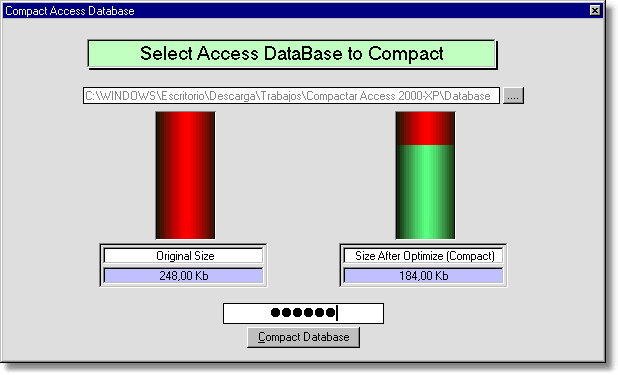



## Compact Access 2000/XP Databases with one line of Code\. Fast\. Easy\.

### Description

Compact Access Databases with one line of Code!

"One line of Code", like this: ;-)

CompactDB Database, ShowResume, Password

or this example:

CompactDB App.Path &amp; "\Datos.mdb", True, "Joselo.11&#183;#"

Private Sub CompactDB_Click()

If DB Is Nothing Then 'the database is Closed

CompactDB App.Path &amp; "\Datos.mdb", True, "Joselo.11&#183;#" 'compact

Else 'the database is open

DB.Close 'close

CompactDB App.Path &amp; "\Datos.mdb", True, "Joselo.11&#183;#" 'compact

[Call your Routine to load database] 'Open database

End If

End Sub

Works fine with Access 2000 and XP

Actual Revision - Jan/20/2004

Jan/20/2004

&#183; some Form changes.

&#183; fixed some variables declarations. (Variants in place of Strings).

&#183; added Compact Password protected databases.

&#183; added some Comments.

&#183; added some Code examples.

&#183; added a compress level indicator.

Jul/25/2003

&#183; Initial Release
 
### More Info
 

             |
---                |---
**Submitted On**   |2004-01-20 03:49:14
**By**             |[José Luis Farías](https://github.com/Planet-Source-Code/PSCIndex/blob/master/ByAuthor/jos-luis-far-as.md)
**Level**          |Intermediate
**User Rating**    |4.8 (29 globes from 6 users)
**Compatibility**  |VB 6\.0
**Category**       |[Databases/ Data Access/ DAO/ ADO](https://github.com/Planet-Source-Code/PSCIndex/blob/master/ByCategory/databases-data-access-dao-ado__1-6.md)
**World**          |[Visual Basic](https://github.com/Planet-Source-Code/PSCIndex/blob/master/ByWorld/visual-basic.md)
**Archive File**   |[Compact\_Ac1700421272004\.zip](https://github.com/Planet-Source-Code/jos-luis-far-as-compact-access-2000-xp-databases-with-one-line-of-code-fast-easy__1-47342/archive/master.zip)

